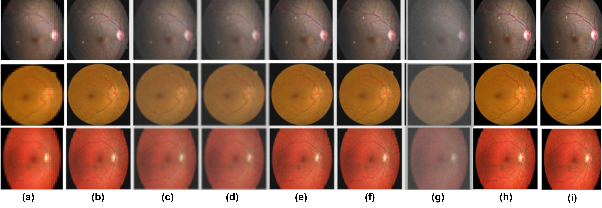
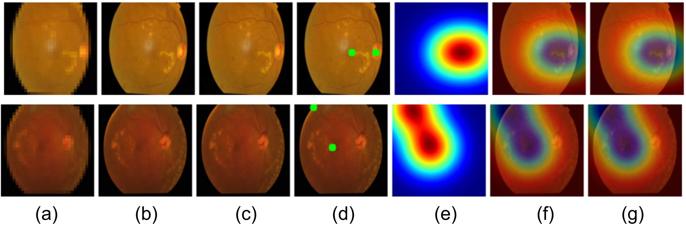
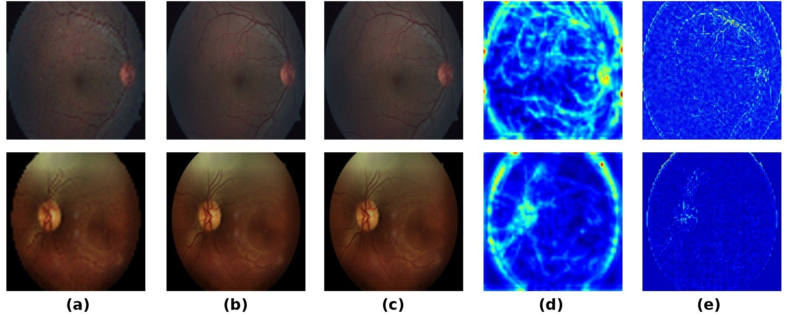
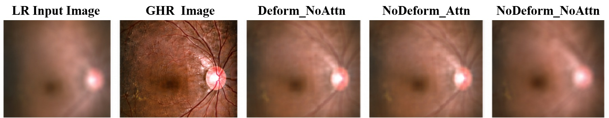
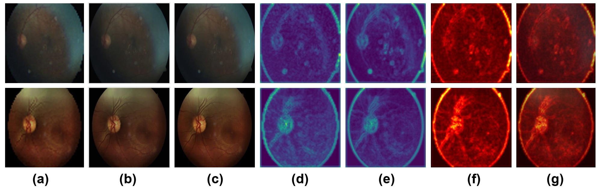
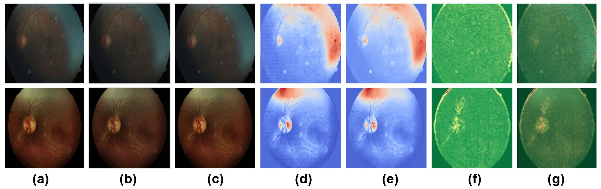
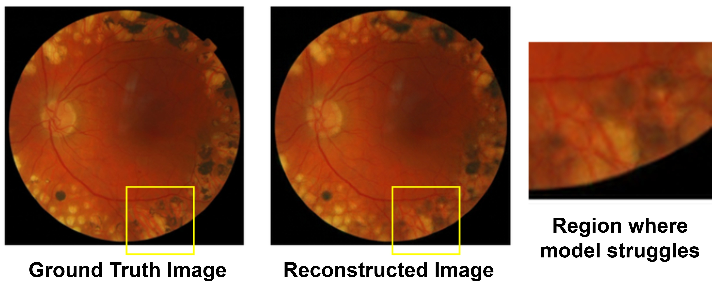
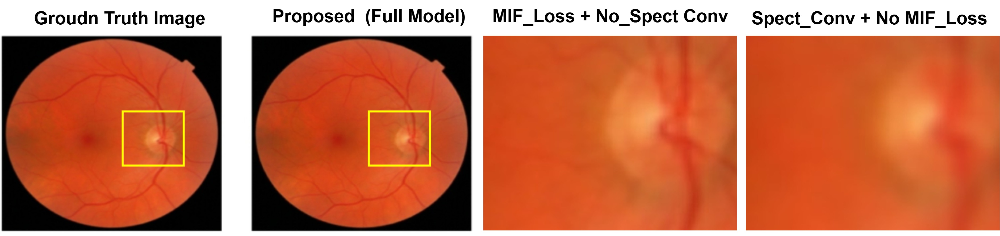
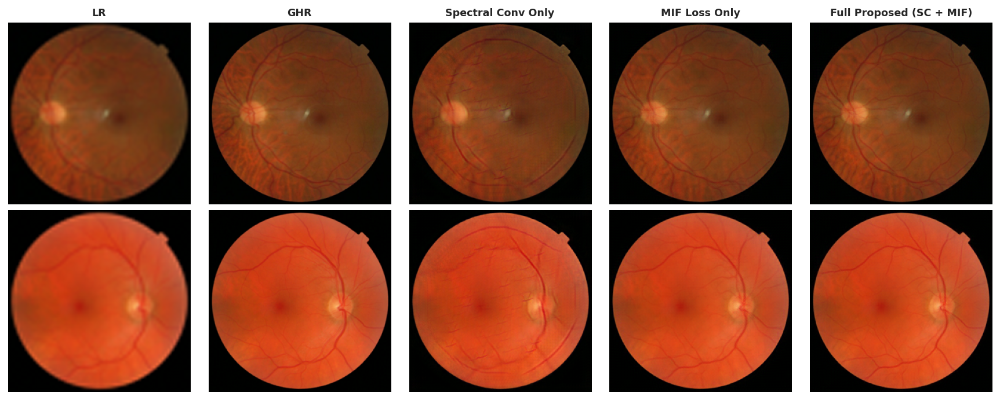

# DHA-ESRGAN
### Deformable Hybrid Attention ESRGAN for Retinal Fundus Image Super-Resolution

Official PyTorch implementation of **DHA-ESRGAN**, a GAN-based retinal fundus image super-resolution framework incorporating deformable convolution, hybrid attention, and Multi-Information Fusion (MIF) loss.

---

## Repository Structure

```
Dha-ESRGAN_Github/
│
├── assets/
│   ├── rs_4_1.jpg
│   ├── rs_6.jpg
│   ├── rs_7.jpg
│   ├── rs_8.jpg
│   ├── rs_9.jpg
│   ├── rs_10.jpg
│   ├── rs_15.jpg
│   ├── rs_16.jpg
│   ├── ablation_spec_mif.png
│   └── messi_abl_1.png
│
├── discriminator.pdf
├── final_sr.pdf
├── README.md
```

---

# Network Architecture

## Generator

📄 **Generator Architecture**

👉 [Open Generator Architecture (PDF)](final_sr.pdf)

---

## Discriminator

📄 **Discriminator Architecture**

👉 [Open Discriminator Architecture (PDF)](discriminator.pdf)

---

# Qualitative Results

<p align="center">

</p>
---
<p align="center">

</p>
---

# Additional Reconstruction Results

<p align="center">

</p>

<p align="center">

</p>

<p align="center">

</p>

<p align="center">

</p>

<p align="center">

</p>

<p align="center">

</p>

<p align="center">

</p>

---

# Ablation Study

## Spectral Convolution and MIF Loss

<p align="center">

</p>

---


---

# Citation

```bibtex
@article{Ujgare2026,
  title={DHA-ESRGAN: Deformable Hybrid Attention ESRGAN for Retinal Fundus Image Super-Resolution},
  author={Nitin S. Ujgare and K. V. Arya and Deepak Kumar Dewangan},
  journal={Under Review},
  year={2026}
}
```

---

## Contact

**Nitin S. Ujgare**

ABV-IIITM Gwalior

Email:
- nitinu@iiitm.ac.in
- nitin.ujgare@gmail.com
